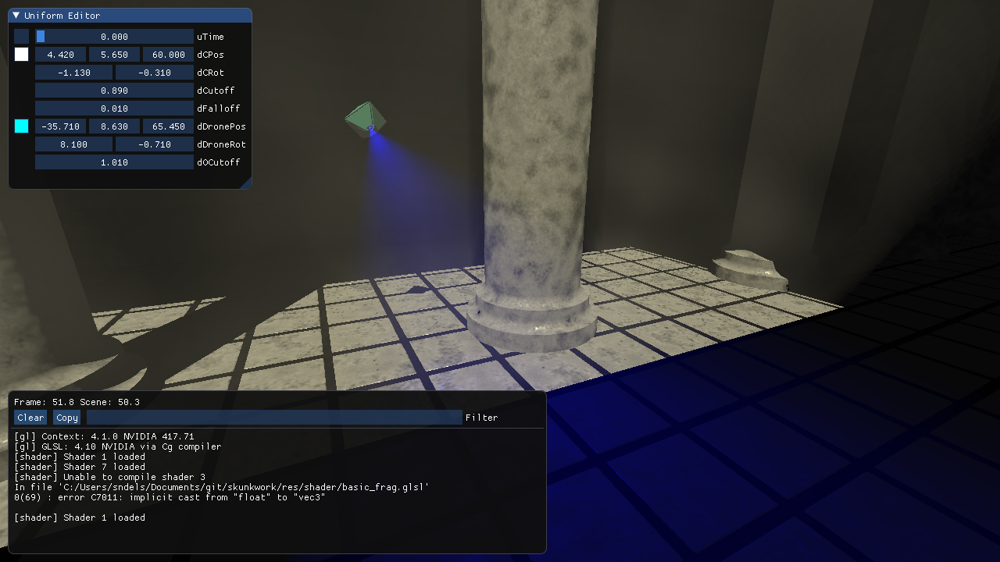

# skunkwork

A lightweight framework for fooling around with GLSL-shaders, mainly designed for demos. Current features:
  * Includes in glsl
    * nesting supported
    * error lines parsed per file on nvidia and intel drivers
  * Dynamic uniform edit UI
    * `d*` Hungarian notation uniforms are picked up
    * `float`, `vec2` and `vec3` currently supported
  * Log window with profiling and shader info
  * Auto-reloading shaders when sources are saved
  * Gpu-"profiler"
    * Timing instances can't be interleaved because GL_TIMESTAMP doesn't work on OSX
  * Music playback and sync using BASS
  * Rocket-interface
    * `float` uniforms using `r*` Hungarian notation are picked up dynamically
  * Mercury's [hg_sdf](http://mercury.sexy/hg_sdf) included for CSG

I have used [emoon's](https://github.com/emoon/rocket) as my Rocket-server.

## Build targets
There are two builds: `skunkwork` holds all the bells and whistles while `skunktoy` drops Rocket and BASS integration for more minimalist shader tinkering.

## Dependencies
Building requires OpenGL dev libraries. [BASS](http://www.un4seen.com/bass.html) is included as a dynamic library under its non-commercial license, while [GLFW3](http://www.glfw.org), [dear imgui](https://github.com/ocornut/imgui), [Rocket](https://github.com/rocket/rocket) and [gl3w](https://github.com/sndels/libgl3w) are submodules with their respective licenses.

## Building
The CMake-build should work™ on OSX, Linux and Windows 10 (Visual Studio 2017) using cmake.
